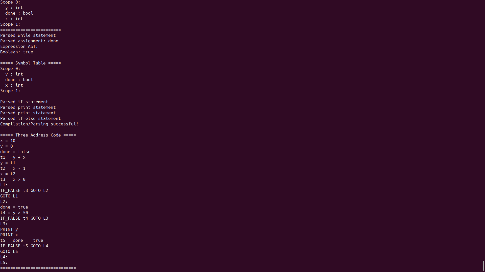
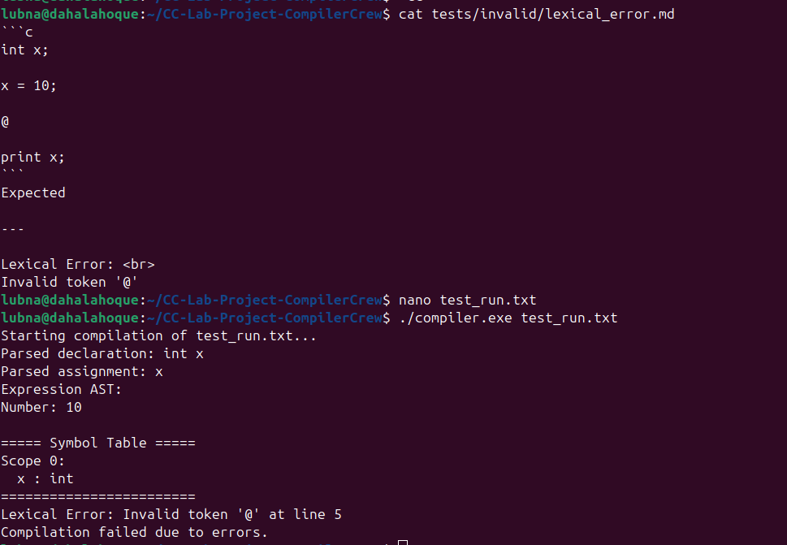
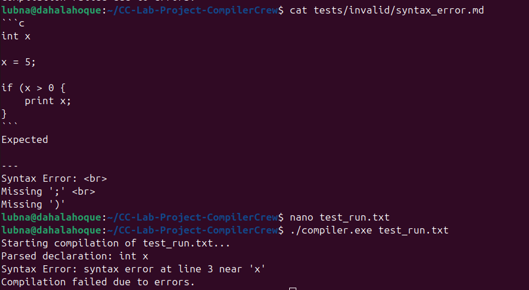
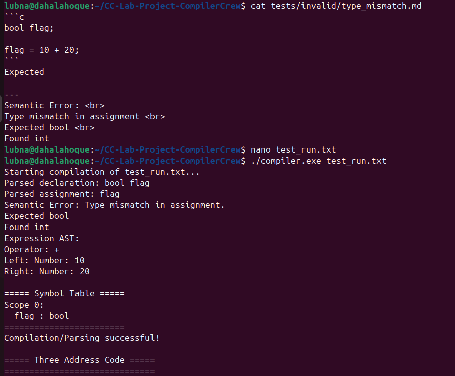

# Compiler Construction Lab Project Report

## Design and Implementation of a Mini Programming Language Compiler Using Flex and Bison

---

### Course

Compiler Construction Laboratory

Department of Computer Science and Engineering

Metropolitan University, Sylhet, Bangladesh

---

### Team Name

Compiler Crew

---

### Team Members

| Role | Name |
|------|------|
| Team Leader | Lubna |
| Member 2 | Maisha Rahman |
| Member 3 | Dahala Hoque |

---

### GitHub Repository

https://github.com/lubnahoque/CC-Lab-Project-CompilerCrew

---

**Submission Date:** 01/08/2026

**August 2026**

# 1. Introduction

A compiler is a software system that translates a high-level programming language into a lower-level representation that can be executed by a computer.

This project demonstrates the implementation of a mini compiler front-end using Flex, Bison, and C++.

The compiler performs lexical analysis, syntax analysis, Abstract Syntax Tree (AST) construction, semantic analysis, symbol table management, and Three Address Code (TAC) generation. The project was developed in the Ubuntu Linux environment using GNU tools and version controlled through Git and GitHub.

The main objective of the project is to understand the complete compiler pipeline by implementing each phase individually and integrating them into a working compiler.

# 2. Objectives

The objectives of this project are:

- Implement a lexical analyzer using Flex.
- Implement a parser using Bison.
- Construct an Abstract Syntax Tree (AST).
- Maintain a Symbol Table for identifiers.
- Perform semantic analysis.
- Detect lexical, syntax, and semantic errors.
- Generate Three Address Code (TAC).
- Build and test the compiler in Ubuntu using Make.

# 3. Language Specification

The implemented mini programming language supports a limited set of language constructs suitable for demonstrating compiler construction concepts.

## Context-Free Grammar (CFG)

The following simplified grammar represents the core structure of our language.

```text
program        → statements

statements     → statement
               | statements statement

statement      → declaration ';'
               | assignment ';'
               | print_stmt ';'
               | if_stmt
               | while_stmt

declaration    → type IDENTIFIER

assignment     → IDENTIFIER '=' expression

print_stmt     → print expression

if_stmt        → if '(' expression ')' block
               | if '(' expression ')' block else block

while_stmt     → while '(' expression ')' block
```

## 3.1 Data Types

The compiler supports the following primitive data types:

- int
- float
- bool

## 3.2 Variable Declaration

Example:

```c
int x;
float pi;
bool flag;
```

## 3.3 Assignment Statement

Example:

```c
x = 10;
flag = true;
```

## 3.4 Print Statement

Example:

```c
print x;
```

## 3.5 Conditional Statements

Supported:

```c
if(condition)
{
    ...
}
```

and

```c
if(condition)
{
    ...
}
else
{
    ...
}
```

## 3.6 Loop Statement

Supported:

```c
while(condition)
{
    ...
}
```

## 3.7 Supported Operators

### Arithmetic

```
+
-
*
/
%
```

### Relational

```
>
<
>=
<=
==
!=
```

### Logical

```
&&
||
!
```

# 4. Compiler Architecture

The compiler is organized into several phases. Each phase performs a specific task before passing information to the next stage.

```
Source Program
        │
        ▼
Lexical Analyzer (Flex)
        │
        ▼
Syntax Analyzer (Bison)
        │
        ▼
Abstract Syntax Tree (AST)
        │
        ▼
Semantic Analysis
        │
        ▼
Symbol Table
        │
        ▼
Three Address Code (TAC)
```

## Lexical Analysis

The lexical analyzer reads the source program and converts it into a stream of tokens.

## Syntax Analysis

The parser checks whether the token sequence follows the grammar rules.

## Abstract Syntax Tree

The parser constructs an AST representing the hierarchical structure of the program.

## Semantic Analysis

Semantic analysis verifies declaration rules, scope rules, and type compatibility.

## Symbol Table

The symbol table stores identifiers together with their types and scope information.

## Three Address Code

The final phase generates intermediate code using Three Address Code (TAC) instructions.

## 5. Lexer Design

The lexical analyzer is implemented using **Flex**.

Source file:

```
src/lexer/lexer.l
```

The lexer recognizes the following token categories:

- Keywords
- Identifiers
- Integer constants
- Floating-point constants
- Boolean literals
- Arithmetic operators
- Relational operators
- Logical operators
- Delimiters
- Comments

Whitespace and comments are ignored during tokenization.

Invalid symbols are reported as lexical errors with the corresponding line number.

Example:

Input

```c
int x;
```

Generated tokens

```
INT IDENTIFIER ;
```

# 6. Parser Design

The parser is implemented using **GNU Bison**.

Source file:

```
src/parser/parser.y
```

The parser receives tokens from the lexical analyzer and checks whether they satisfy the grammar rules of the language.

The grammar supports the following constructs:

- Variable declarations
- Assignment statements
- Print statements
- Arithmetic expressions
- Relational expressions
- Boolean expressions
- if statements
- if-else statements
- while loops
- Nested blocks

Operator precedence and associativity are defined inside the grammar to correctly parse arithmetic and relational expressions.

Whenever the parser recognizes a valid statement, it constructs the corresponding Abstract Syntax Tree (AST) nodes.

Syntax errors are detected during parsing and reported together with the line number and unexpected token.

# 7. Abstract Syntax Tree (AST)

The compiler constructs an Abstract Syntax Tree (AST) during parsing.

The AST represents the hierarchical structure of the source program and serves as the bridge between parsing and semantic analysis.

The AST implementation is located in:

```
src/ast/
```

Implemented node classes include:

- ASTNode
- ExpressionNode
- NumberNode
- FloatNode
- BooleanNode
- IdentifierNode
- BinaryExpressionNode
- UnaryExpressionNode

Each node stores the information necessary for semantic analysis and Three Address Code generation.

The AST can also be printed during execution to visualize parsed expressions.

# 8. Symbol Table

The Symbol Table is implemented in:

```
src/semantic/SymbolTable.h
```

The symbol table stores information about declared identifiers.

Each entry contains:

- Variable name
- Data type
- Scope level

The symbol table supports the following operations:

- Insert variable
- Search variable
- Check redeclaration
- Check undeclared variables
- Enter new scope
- Exit scope

Nested scopes are maintained using a stack of symbol tables, allowing local variables inside blocks while preserving outer scopes.

# 9. Semantic Analysis

Semantic analysis verifies whether the parsed program is logically correct.

The compiler performs the following semantic checks:

- Undeclared variable detection
- Variable redeclaration detection
- Scope violation detection
- Type mismatch detection
- Invalid assignment detection
- Boolean condition checking for if and while statements

Examples of detected errors include:

- Assigning an integer value to a boolean variable
- Using variables before declaration
- Redeclaring an existing variable within the same scope
- Accessing variables outside their valid scope

Whenever a semantic error is detected, the compiler prints a meaningful error message to help the programmer identify the problem.

# 10. Three Address Code (TAC)

The compiler generates intermediate code in the form of Three Address Code (TAC).

The TAC generator is implemented in:

```
src/tac/
```

The TAC module produces intermediate instructions for:

- Assignment statements
- Arithmetic expressions
- Relational expressions
- Print statements
- if statements
- if-else statements
- while loops

Temporary variables (t1, t2, ...) are automatically generated for intermediate computations.

Labels (L1, L2, ...) are generated for control flow.

Example:

Source Program

```c
c = a + b * 2;
```

Generated TAC

```
t1 = b * 2
t2 = a + t1
c = t2
```

The generated TAC can be printed after successful compilation for debugging and verification.

# 11. Challenges Faced

Several challenges were encountered during the development of the compiler.

Major challenges included:

- Designing a correct grammar in Bison.
- Constructing AST nodes during parsing.
- Implementing nested scope handling.
- Detecting semantic errors correctly.
- Integrating the Symbol Table with the parser.
- Generating Three Address Code for arithmetic expressions.
- Generating TAC for conditional and loop statements.
- Debugging parser conflicts and compiler build issues.

These challenges were resolved through testing, debugging, and incremental development.

# 12. Testing

The compiler was tested using both valid and invalid programs.

| Test Case | Result |
|------------|--------|
| Valid Program | Passed |
| Lexical Error | Passed |
| Syntax Error | Passed |
| Undeclared Variable | Passed |
| Redeclaration | Passed |
| Scope Violation | Passed |
| Type Mismatch | Passed |
| Invalid Assignment | Passed |

## Valid Test Programs

- arithmetic.md
- assignment.md
- declaration.md
- while.md
- if_else.md
- complete_program.md

These programs successfully produced:

- Correct parsing
- AST generation
- Semantic checking
- Three Address Code generation

## Invalid Test Programs

The following error conditions were tested:

- Undeclared variable
- Redeclaration
- Type mismatch
- Invalid assignment
- Scope violation
- Syntax error
- Lexical error

The compiler correctly detected and reported these errors without crashing.

Testing confirmed that the implemented compiler modules work together successfully.

### Screenshots

The following screenshots demonstrate the successful execution and error handling of the compiler.

## Figure 1: Valid Compilation

{ width=90% }

\newpage

## Figure 2: Lexical Error

{ width=90% }

\newpage

## Figure 3: Syntax Error

{ width=90% }

\newpage

## Figure 4: Semantic Error

{ width=90% }

\newpage

## Build Instructions

The project can be built using the provided Makefile.

```bash
make
```

The executable generated is:

```
compiler.exe
```

## Execution Instructions

Run the compiler using:

```bash
./compiler.exe test_run.txt
```

The compiler performs:

- Lexical Analysis
- Syntax Analysis
- AST Construction
- Semantic Analysis
- Three Address Code (TAC) Generation

If lexical, syntax, or semantic errors are detected, appropriate error messages are displayed.
# 13. Conclusion

This project provided practical experience in implementing the major phases of a compiler using Flex, Bison, and C++.

The completed compiler successfully performs lexical analysis, syntax analysis, AST construction, semantic analysis, symbol table management, and intermediate code generation.

Throughout the project, we gained valuable experience in compiler design, debugging, version control using Git and GitHub, and collaborative software development.

# 14. References

1. Compiler Construction Lab Project Manual, Metropolitan University.

2. GNU Flex Documentation
https://westes.github.io/flex/manual/

3. GNU Bison Documentation
https://www.gnu.org/software/bison/manual/

4. C++ Reference
https://en.cppreference.com/

5. Git Documentation
https://git-scm.com/doc


